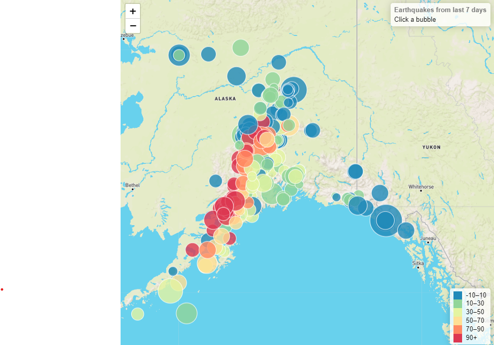
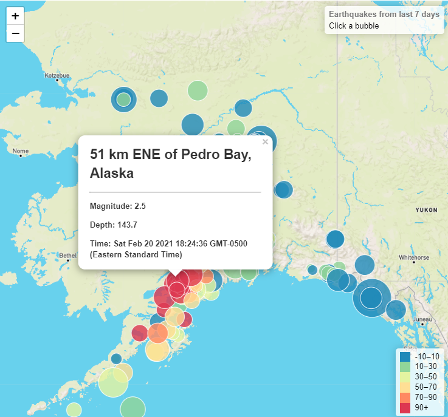

# leaflet-challenge

The assignment was to visit the USGS GeoJSON Feed page and pick a data set about earthquakes to visualize with Leaflet. 
 
I chose a data set of earthquakes of magnitude 1.0+ over the last 7 days.

Each bubble represents an earthquake. Size represents magnitude and colour represents depth in the earth resonated. Each bubble has a pop up.

